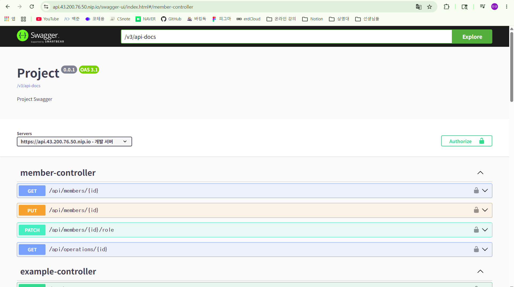
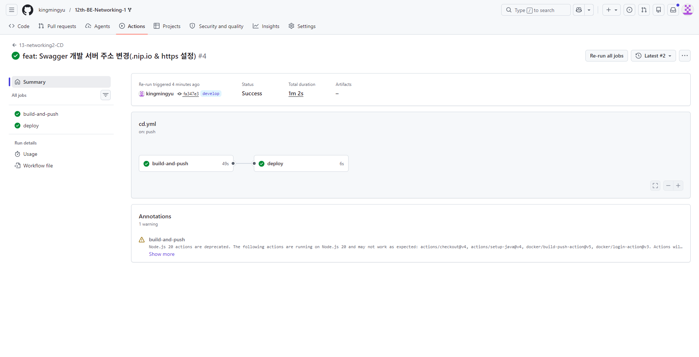

# 아키텍처 다이어그램(사용자 흐름)

```text
사용자
  ↓
.nip.io 도메인
  ↓
Nginx
  ↓
Spring Boot 컨테이너
  ↓
AWS Aurora MySQL
```

# 배포 URL
```text
https://api.43.200.76.50.nip.io/
```
```text
https://api.43.200.76.50.nip.io/swagger-ui/index.html
```

# Swagger 접속 화면


# GitHub Actions 성공 화면


# Dockerfile
```dockerfile
FROM eclipse-temurin:17-jdk-alpine

WORKDIR /app

COPY build/libs/*SNAPSHOT.jar app.jar

ENTRYPOINT ["java", "-jar", "-Duser.timezone=Asia/Seoul", "app.jar"]
```

# Nginx
- 엔진 엑스 설치 및 인증서 발급
```text
sudo apt install -y certbot python3-certbot-nginx
sudo certbot --nginx -d api.43.200.76.50.nip.io
```

# 트러블 슈팅

- CI 검증 실패
```text
문제:
GitHub Actions(CI) 파이프라인 실행 중 빌드 및 검증(Test) 단계에서 실패(Fail) 오류가 발생했다.

원인:
프로젝트 설정 파일(.yml)에 작성되어 있는 환경변수 이름과, 실제 CI 환경(GitHub Secrets 등)에 등록해 둔 환경변수 이름이 서로 일치하지 않았다. 이로 인해 애플리케이션 빌드 시 필요한 설정 값을 정상적으로 주입받지 못해 검증에 실패했다.

해결:
설정 파일(.yml)의 환경변수 네이밍과 CI 툴에 등록된 환경변수 키값을 꼼꼼히 비교하여 동일하게 일치하도록 수정한 뒤 다시 Push 하였고, CI 검증을 정상적으로 통과시켰다.
```

- CD 빌드 실패
```text
문제:
GitHub Actions(CD) 파이프라인의 Docker 이미지 빌드 및 푸시 단계에서 open Dockerfile: no such file or directory 에러가 발생하며 배포가 실패했다.

원인:
GitHub Actions가 컨테이너 이미지를 빌드하기 위해 프로젝트 최상단(Root) 경로에서 Dockerfile을 찾으려 했으나, 해당 파일이 작성 및 커밋되어 있지 않아 도커 빌드 명령어(docker buildx build)를 수행할 수 없었다.

해결:
프로젝트 루트 디렉토리에 Spring Boot 애플리케이션을 기반으로 도커 이미지를 생성하기 위한 Dockerfile을 새롭게 작성하여 추가한 뒤 다시 코드를 Push 하였고, CD 빌드 및 배포 과정을 정상적으로 완료시켰다.
```

- DB 접근 문제
```text
문제:
EC2에서 DB 서버에 접근하는 데는 성공했으나, networking2라는 이름의 데이터베이스를 찾지 못해 애플리케이션 연결 오류(Unknown database)가 발생했다.

원인:
DB 인스턴스 자체에는 정상적으로 연결되었으나, 내부에 애플리케이션(Spring Boot) 설정에 지정된 networking2 스키마(데이터베이스)가 생성되어 있지 않았다.

해결:
로컬 환경의 인텔리제이(IntelliJ) 데이터베이스 도구를 이용해 해당 AWS DB 서버에 원격으로 접속한 뒤, CREATE DATABASE networking2; 쿼리를 직접 실행하여 데이터베이스를 생성해 주었다. 이후 애플리케이션이 정상적으로 연결 및 실행되었다.
```

- https 접속 거부
```text
문제:
Nginx 리버스 프록시 설정 후 HTTPS(https://api...nip.io) 환경으로 접속을 시도했으나 연결이 거부되며 접속되지 않았다.

원인:
초기 Nginx 설정 파일(default)에 443 포트(HTTPS) 수신 설정 및 SSL 인증서 연결 코드가 누락되어 있었다.
문제를 해결하고자 Certbot으로 인증서 신규 발급을 시도했으나, 공용 와일드카드 도메인인 nip.io의 Let's Encrypt 주간 발급 횟수 제한(Rate Limit)에 걸려 새로운 발급이 거절되었다.

해결:
서버 내부에 과거에 성공적으로 발급받아 둔 유효한 기존 인증서 파일이 남아있는 것을 확인했다. certbot --nginx 명령어를 실행한 뒤 '기존 인증서 재설치(Attempt to reinstall this existing certificate)' 옵션을 선택했다. 이를 통해 Certbot이 자동으로 Nginx 설정 파일에 443 포트 개방, SSL 인증서 절대 경로 삽입, HTTP(80) 요청 시 HTTPS(443) 자동 리다이렉트 코드를 추가하고 Nginx를 재시작하게 하여 해결했다.
```